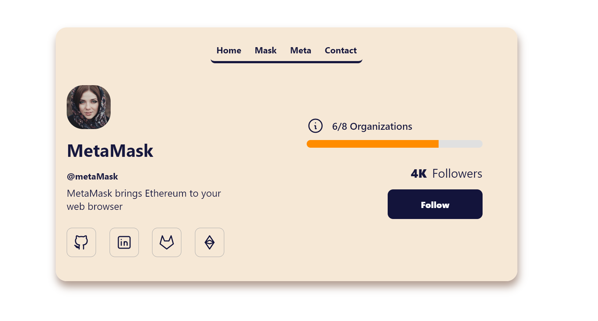
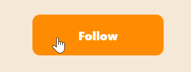
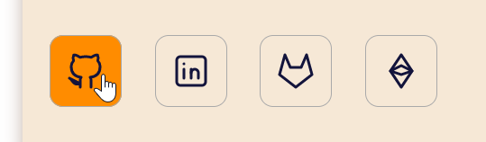
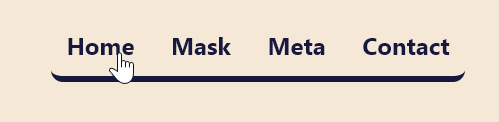

# 🧩 CSS Inline and blocks

You are going to practice inline vs block elements by building the design found under `/design` folder

## 🏁 STEPS

1. Follow AND read the following HTML guide: [HTML GUIDE](https://www.w3schools.com/htmL/html5_syntax.asp)

2. Your task is to create a website that **_closely_** resembles (looks as close as possible) to the one found under `/design` folder <br>
   ⚠️ **_NOTE_**: Make sure your final design also follows what is inside `/design/hover-states/` images. <br>
   <br>

---

### Hover States







<https://github.com/juan-instructor-atc/block-1-project-3-meta-mask/assets/129880571/2410e977-a0ea-4ade-98ee-a686db2f003f>

---

3. Create any necessary files for your project. Ex. `index.html` and any other files/folders required in this project `root folder`. <br>

4. Here is the `CSS` you will need for this project to change the fonts in your website

```CSS
  body {
    font-family: 'Segoe UI', Tahoma, Geneva, Verdana, sans-serif;
    font-weight: 600;
  }
```

⚠️ **_NOTE_**: We will talk more about fonts and how to change them. For now you should know that you can have `font-family` property inside the `body` selector to choose which font to use for your website. <br>

5. In this project you can **_ONLY_** **_AND MUST_** use:

```HTML
    <header></header>
    <nav></nav>
    <ul></ul>
    <li></li>
    <section></section>
    <div></div>
    <span></span>
    
    <h1></h1>
    <br>
    <a></a> <!-- can you make a <a> element that looks like a button 🤔 -->
```

6. To find out which colors to use (HEX colors), install a browser extension `ColorPick EyeDroppper`. Go to the following [link](https://addons.mozilla.org/en-US/firefox/addon/colorpick-eyedropper/) to install it for your browser.<br>

7. The **ONLY** CSS **ALLOWED** and you can **RESEARCH** more about is the following:<br>
   ⚠️ **_NOTE_**: You cannot use **_negative margin_**<br>
   - Give the **_right_** names to your `classes`. Ex. `woman-glasses-container`, `woman-glasses-image` `links-container`, `home-link`, `meta-link`, `organizations-container`, `follow-button`, `icons-container`, `icons-one`, `icon-github`, etc. Based on the content, provide meaningful names to your `classes`

```CSS
* {
  font-family: /* value should be the one I mentioned in step 4 */;
  font-weight: /* value could be anything between 100 - 900. Explore 💡 */;
  font-size: /* Value should be in Pixels */;
  color: /* Change font color */;
  margin: /* -top, -bottom, -left, -right*/;
  padding: /* -top, -bottom, -left, -right*/;
  width: /*Value could be percentage (30%) or pixels */;
  height: /*Values must be in PX as percentages do not work, I'll explain later */;
  border-radius: /*Values must be in PX*/;
  border-bottom: /* Value should be here */;
  border: /* Value should be here */;
  vertical-align: /* 🤔 you might need to do some research but you can use %percent (Ex.20%) values */;
  display: /*Values can only be inline, inline-block or block */;
  cursor: /* You see the hand cursor on the videos, this property might help. Research is needed*/;
  outline: /* This is for visually seeing all the boxes on the web as shown by your instructor before */;
  background-color: /* This is self-explanatory */;
  list-style-type: /* More research? */;
  box-shadow: /* You might need to research about this one */;
  border-bottom-left-radius: /* value could be in px */;
  border-bottom-right-radius: /* value could be in px */;
  border-top-left-radius: /* value could be in px */;
  :hover
}
```

---

## 😃 Start coding

- Remember to follow excellent quality control procedures (i.e., no space in folders or names, HTML indentation/spacing, closing tags, etc.)
- Use a style guide - [HTML Style Guide](https://www.w3schools.com/htmL/html5_syntax.asp)
