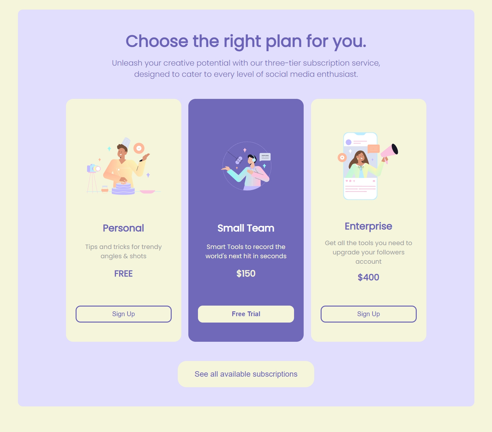

# 😎 Inline Pricing Panel

## 🏁 STEPS

1. Your task is to create a website that **_closely_** resembles (looks as close as possible) to the one found under `/design` folder:<br>
   ⚠️ **_NOTE_**: Make sure your final design also follows what is inside `/design/hover-states` videos and screenshots . <br>

---

<br>

---

2. Create any necessary files for your project. Ex. `index.html` and any other files/folders required in this project `root folder`. <br>
3. In this project you can **_ONLY_** use:

```HTML
    <section></section>
    <div></div>
    <header></header>
    <!--
      After reading the following pieces, you can see the header can be used in multiple places:

      1. Source: https://html.spec.whatwg.org/multipage/sections.html#the-header-element

      2. Source: https://www.w3schools.com/tags/tag_header.asp
    -->

    <main>
    <!--
      Some useful information and research on the <main> element

      1. Source: https://developer.mozilla.org/en-US/docs/Web/HTML/Element/main
    -->
    </main>

    <span></span>
    
    <p></p>
    <h1></h1>
    <h2></h2>
    <button></button>
```

4. We are going to use **_Google Fonts_** once more. Here's the link to the font we would use for this project: [Link to Google Fonts](https://fonts.google.com/specimen/Poppins?query=pop)
   ⚠️ **_NOTE_**: Make sure you select regular (400) and semibold (600).

```CSS
  body {
    font-family: 'Poppins', sans-serif;
  }
```

5. Use **_ColorPicker Eyedropper_** to find HEX colors.

---

6. The **_ONLY_** CSS **_ALLOWED_** and you can **_RESEARCH_** more about is the following:<br>
   ⚠️ **_NOTE_**: You cannot use **_negative margin_**<br>

   - Always `center` elements when the design requires it.
   - You must use `max-width` of at least `950px` **_ONLY_** 1 time.
   - `width` is only allowed **_1_** time in the `p` element inside the `header` element.
   - The only value allowed for `margin` is `auto` and must be used ONLY **_1_** time.
   - `text-align: center` is only allowed on the `h1` and `header p` elements.
   - `width` and `height` are not allowed.

   - ⚠️ If you start every project with this css, you will remove every default padding or margin to adjust to your needs.

```CSS
   * {
      margin: 0;
      padding: 0;
   }
```

```CSS
selector {
  font-family: /* value should be the one I mentioned in step 4 */;
  font-weight: /* value could be anything between 100 - 900. Explore or research 💡 */;
  text-transform: /* 😊 */;
  font-size: /* Value in PX */;
  color: /* HEX color */;
  max-width: /* Google Search and value must be in pixels */;
  height: /* Only are allowed for  elements */;
  display: /* can only be inline, block inline-block */;
  outline: /* This is for visually seeing all the boxes on the web as shown by your instructor before */;
  border: /* 😊 */;
  border: /* none: removes any unwanted borders */;
  border-radius: /* 😀 */;
  background-color: /* This is self-explanatory */;
  box-shadow: /* You have used this property before */;
  cursor: /* to the hand */;
  :hover;
  :active;
  transform: scale /* Google Time */;
}
```

7. All images must have the following specifications: - `width: 200px;` - `height: 200px;`
   <br>

8. All `` elements must have the attribute `alt`. Make sure you include that attribute and use proper names. More info can be found at: [The ALT attribute](https://www.w3schools.com/TAGS/att_img_alt.asp)

---

## 😃 Start coding

- Remember to follow excellent quality control procedures (i.e., no space in folders or names, HTML indentation/spacing, closing tags, etc.)
- Use a style guide - [HTML Style Guide](https://www.w3schools.com/htmL/html5_syntax.asp)
